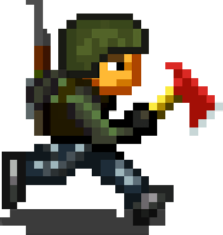

# MiniDayZ (Plus)

###### The Browser (and PC) port of Bohemia Interactive's mobile game

## Notes
* Current build is **Plus 1.2**
* You can change controls from stick to tap/draw (better for PC)
* Try to F11/Fullscreen before the game loads

___
## [Original 1.4.1](https://raw.githack.com/NextDev65/MiniDayZ/main/docs/index.html) by [Bohemia Interactive](https://minidayz.com/home)
  * https://minidayz.com/blog/mini-dayz-browser-version-will-no-longer-be-supported (bohemia stopped hosting)
## Mods
  * ### [Reloaded 1.1](https://raw.githack.com/NextDev65/MiniDayZ/main/reloaded_docs/index.html) by [Kev3232](https://discord.gg/CSktjeQWtC)
  * ### [Plus 1.2](https://nextdev65.github.io/MiniDayZ/) by [Altero](https://discord.gg/CSktjeQWtC)
    * Exported to apk by [meterpreter](https://github.com/MeterPreter57/)
